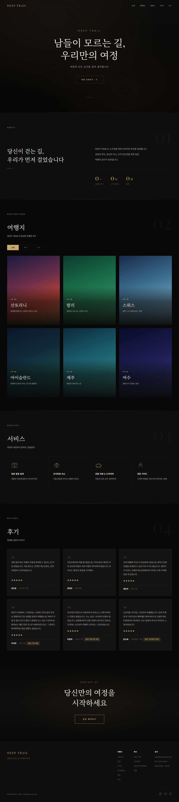
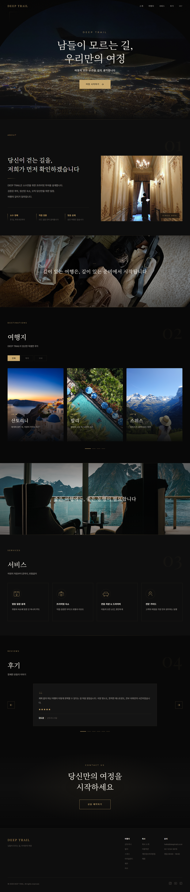

# DEEP TRAIL — 남들이 모르는 길, 우리만의 여정
> 소수만을 위한 프라이빗 럭셔리 투어 가이드 브랜드 사이트입니다.
> AI 도구를 활용한 이미지 생성 및 코드 작성 워크플로우를 적용한 프로젝트입니다.

## Project Summary
| 항목 | 내용 |
| :--- | :--- |
| **작업 기간** | 2026.08.18 - 2026.08.20 |
| **담당 역할** | 기획, UI/UX 디자인, 퍼블리싱 (단독 진행 100%) |
| **기술 스택** | HTML5, CSS3, jQuery |
| **AI 활용** | Claude Code (코드 작성), Photoshop Generative Fill (이미지 생성/보정) |
| **배포 링크** | [사이트 바로가기](https://yeonju-s5.github.io/DeepTrail/) |

## Tech Stacks
<p>
  
  
  
  
  
</p>

## Key Features

### 다크 럭셔리 테마
- 다크 배경(#080808) + 골드 액센트(#c9a96e) 컬러 시스템
- 폰트 조합: Playfair Display (타이틀), Montserrat (서브타이틀/UI), Pretendard (본문)
- SVG 기반 노이즈 텍스처 오버레이

### 인터랙티브 요소
- Intersection Observer 기반 스크롤 리빌 애니메이션
- CSS scroll-snap 가로 스크롤 여행지 카드 트랙
- 여행지 카드 3D 틸트 효과 (마우스 추적)
- 히어로 골드 파티클 애니메이션
- 클릭 리플 이펙트 (전체 페이지)

### 비주얼 브레이크
- 패럴랙스 스크롤 배경 이미지
- 어두운 오버레이 + 타이포그래피 인용문

### AI 활용 워크플로우
- **코드**: 기존 프로젝트의 코드 패턴을 기반으로, Claude Code를 활용해 코드 작성 및 디버깅 효율을 높임
- **이미지**: 무료 스톡 이미지를 기반으로 Photoshop Generative Fill을 활용한 배경 확장 및 보정
- **버전 관리**: Puppeteer 기반 풀페이지 캡처 시스템으로 작업 히스토리 기록

## Directory Structure
```text
DeepTrail/
├── css/
│   └── style.css
├── img/
│   ├── hero.jpg
│   ├── About.png
│   ├── vb1.jpg / vb2.jpg
│   └── dest_*.jpg (여행지 카드 x6)
├── js/
│   └── main.js
├── captures/
│   ├── draft/ (초안 코드 아카이브)
│   └── *.png (버전별 스크린샷)
└── index.html
```

## Before & After
| 초안 (Draft) | 현재 (Current) |
|:---:|:---:|
|  |  |

---
Design & Code by Seo Yeonju. AI-assisted project for portfolio purposes.
